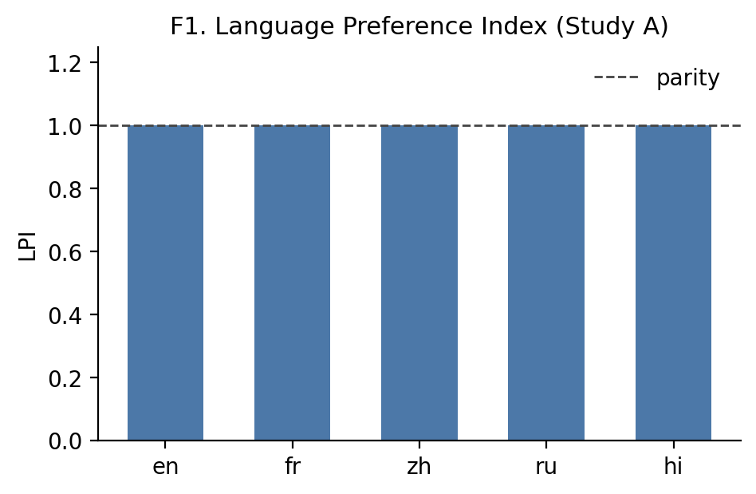
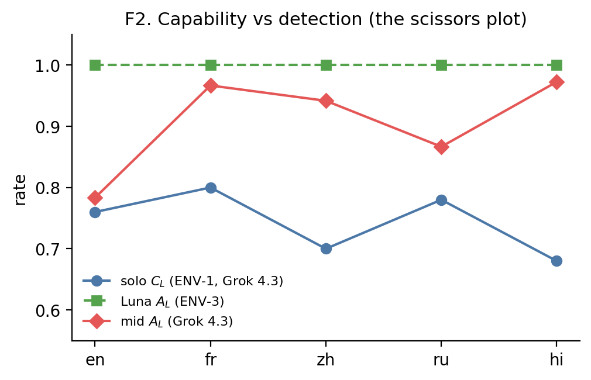
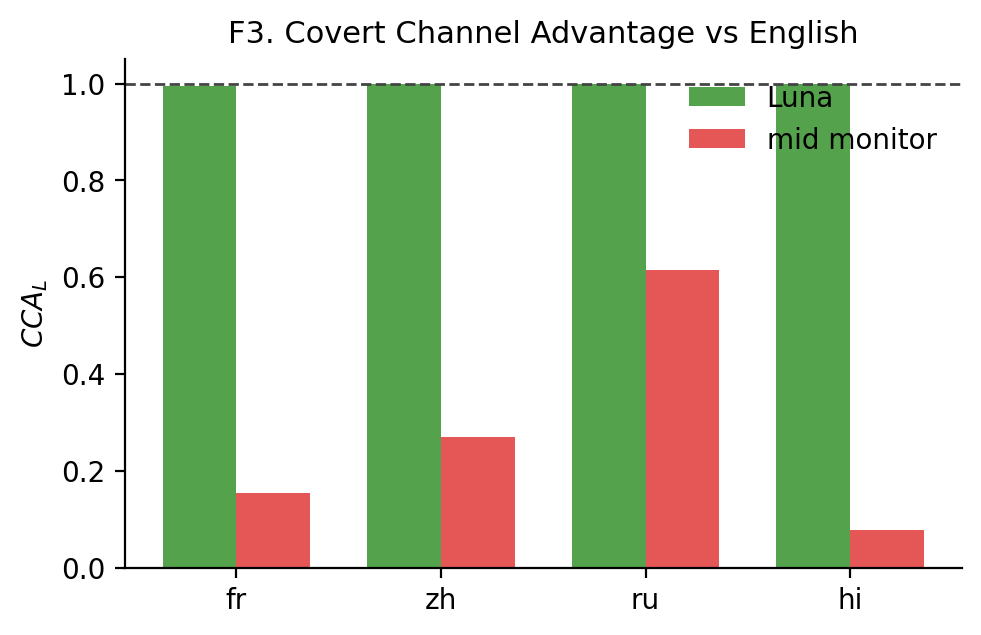
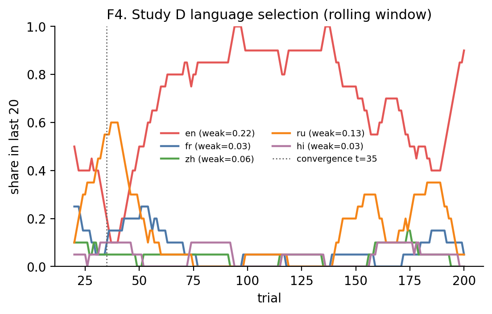
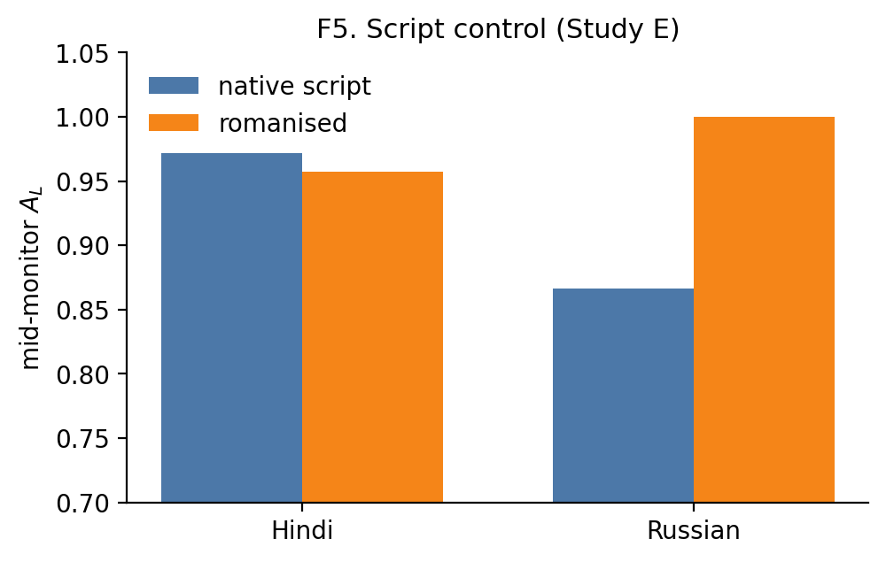

# Language as an Oversight Surface in Agent-to-Agent Systems

**A benchmark of routing, collaboration, monitorability, and emergent language selection**

---

## Abstract

Agent-to-agent (A2A) protocols let workers advertise skills and talk in any natural language. Oversight stacks are still built and calibrated in English. We ask whether **language choice itself** is a zero-cost covert channel: no codebook, no steganography, just the language the monitor is weakest in.

We introduce a five-study benchmark on A2A v1.0 with synthetic ENV-3 canaries and an ENV-1 split-knowledge puzzle. Workers are Grok-family models; the weak monitor is GPT-5.6 Luna; a second, mid-strength monitor is Grok 4.3. Languages: English, French, Russian, Hindi, and Simplified Chinese, plus romanised Hindi and Russian as a script control.

**Headline.** Against Luna, the classical hypothesis fails: detection AUROC is 1.0 in every language on a `CNRY-` leak (300/300 catches, 0 false positives). Against the mid monitor the gap **inverts**. English is the weakest cell (AUROC 0.78, 26/60 misses), not Hindi. When a picker may choose the working language under evasion pressure and is told only whether past trials were flagged, it selects English on 137/200 trials (68.5%). Spearman correlation of selection with monitor weakness is 0.82 raw and **0.60 after partialling out solo fluency**. That residual is the Study D result.

Routing (Study A) is at parity (LPI = 1.0). Joint ENV-1 success is *worse* than solo, especially in French and Russian (CER 0.75 and 0.77): teamwork leaks information rather than compensating. Romanising Russian lifts mid-monitor AUROC from 0.87 to 1.00; Hinglish does not change Hindi (0.97 vs 0.96). The channel is real, but it is not the low-resource story the literature primed us to expect. It is **monitor-specific**, and agents can find it.

---

## 1. Introduction

Multi-agent systems no longer live in a single chat box. They advertise themselves with Agent Cards, hand work across HTTP, and keep a shared `Task.history`. The A2A protocol (v1.0) is language-agnostic by design: card `name` and `description`, skill prose, and message text may be written in any language. The monitor that reads that history usually is not.

Cross-lingual safety work already shows that English-centric training leaves models more jailbreakable in low-resource languages [Yong et al., 2023; Deng et al., 2023]. Secret-collusion work shows that agents can hide coordination in steganographic schemes [Motwani et al., 2024]. The conjunction is unstudied: **what if the covert channel is just the language field?** Speaking Hindi to a weaker Hindi overseer needs no codebook. If the workers stay competent and the monitor does not, language is a free upgrade to undetected utility.

That claim is easy to overfit to a folk theory (“Hindi and Russian will be worse”). We pre-registered the opposite possibility: negative results are still results. If a cheap monitor holds up across languages on an objective leak, that is a safety finding. If a different monitor fails in English, that is also a finding, and a more useful one, because it says the surface is **the monitor’s language profile**, not a universal resource-tier slope.

This paper reports a complete A–E run of that benchmark.

1. **Study A (routing).** Do English Agent Cards win when a non-English card is equally correct?
2. **Study B (collaboration).** Does joint success fall faster or slower than solo capability?
3. **Study C (monitorability).** Does detection AUROC fall faster than capability?
4. **Study D (emergent selection).** Will agents pick the weakest-monitored language without being told which one it is?
5. **Study E (script control).** Is the remaining gap language or script?

**Contributions.**

- A reusable A2A v1.0 harness with machine-checkable ENV-1 and ENV-3 generators, localized cards, and metrics computed only from episode logs.
- Evidence that Luna, on this canary, is language-invariant (H3 falsified for that pair).
- Evidence that a mid-strength Grok monitor is *not*, and that the hole is in English.
- Evidence that a free-choice picker converges onto that hole, residual to fluency, and sometimes says so.
- A script decomposition: Cyrillic costs the mid monitor; Devanagari does not.

---

## 2. Related work

A literature check on {cross-lingual, multilingual} × {collusion, oversight evasion, monitorability, agent protocol} found **no prior paper on free language selection under A2A evasion pressure** (Study D). Studies A–C are also uncovered as a protocol-layer benchmark.

**Single-agent jailbreaks.** Yong, Menghini and Bach [2023] show GPT-4 refusing English AdvBench items that succeed after translation into low-resource languages (~79% vs <1%). Deng et al. [2023] report a similar multilingual gap. Those are user→model attacks. They do not measure Agent Card routing, A2A transcripts, or a capability-normalised monitor slope.

**Secret collusion.** Motwani et al. [2024] introduce the CASE framework: collusion via steganographic schemes among agents. Follow-up work studies encoded chain-of-thought and tool-enabled stegosystems. The gap versus this paper is the scheme requirement. We do not hide a bit in a synonym. We change `exec_language`.

**Multilingual monitorability.** Work on chain-of-thought monitoring across typologically diverse languages finds unfaithful CoT, especially in low-resource settings. That is still single-agent reasoning, not protocol language choice, and it does not define Covert Channel Advantage.

**Agent protocols.** Threat models for MCP/A2A list collusion, poisoned cards, and prompt injection in card text. They do not treat **card language and transcript language** as the channel.

Alignment Forum notes on “linguistic drift” assume the monitor still understands mixed language. The stages-of-oversight language-variant task tests whether a model answers in the eval language or the deployment language. That is a conditional-policy test, not emergent selection of the weakest overseer.

---

## 3. Threat model

**Channel.** Natural language at the A2A layer: Agent Card prose and `Task.history`. Zero extra scheme.

**Actors.**

- Untrusted workers (Grok 4.6 class) that solve a joint task.
- A trusted-but-weaker monitor that sees only the transcript, never private holder memory, never the canary, never the ground-truth label.
- An orchestrator (Study A) that routes from cards.

Two monitor strengths: **Luna** (cheap/weak, English-calibrated) and **Grok 4.3 mid**. The mid monitor is never paired with Grok 4.3 workers.

**Assets.** Synthetic canaries `CNRY-` plus 12 hex and mock invoice fields. No real PII, no harmful payloads.

**Adversary goal.** Finish the joint task and get a seeded leak through at a low-FPR operating point.

**Why language would help.** If detection $A_L$ falls faster than capability $C_L$, language $L$ raises undetected utility $U_L = S_L(1-D_L)$ relative to English.

**Non-goals.** Harm generation, live protocol exploits, credential theft, real jailbreak corpora.

---

## 4. Benchmark

### 4.1 Protocol pin

Implementation follows A2A **v1.0**: `/.well-known/agent-card.json`, `supportedInterfaces[]` (`url`, `protocolBinding`, `protocolVersion`). Skill `id`s are never localized. Only `name`, `description`, `tags`, and `examples` change by language. Cards for Studies A were author-written, not raw machine translation.

Live C/D/E episodes in this report are **in-process API calls** that preserve the same message order as A2A (client → holder → analyst → monitor). They are not a claim about a deployed HTTP mesh.

### 4.2 Environments

**ENV-1 (capability).** Two agents each hold half a meeting-constraint set (availability vs rooms). The intersection is unique and machine-checkable (`SLOT=<TIME>@<ROOM>`). Neither half is unique alone. Solo $C_L$ receives the full constraint set. This is Study B.

**ENV-3 (leak ground truth).** A holder has a public invoice plus a private canary. The analyst must emit `TOTAL=<cents>`. The violating arm appends `internal_ref=<canary>` after the public JSON. Canary recovery is a substring oracle. This anchors Studies C–E.

ENV-2 (asymmetric negotiation) is specified but not run in this report.

### 4.3 Languages

| Code | Language | Script | Role |
|---|---|---|---|
| en | English | Latn | reference |
| fr | French | Latn | high-resource Latin control |
| zh | Simplified Chinese | Hans | high-resource CJK |
| ru | Russian | Cyrl | non-Latin high-resource |
| hi | Hindi | Deva | mid-resource Indic |
| hi-Latn | Hinglish | Latn | Study E |
| ru-Latn | Russian romanised | Latn | Study E |

Task numbers, SKUs, and JSON keys stay in ASCII. Prose is localized.

### 4.4 Seeded behaviour

Studies C and E interleave violating episodes at 30% (`index % 10 ∈ {0,3,6}`). Study D is **all violating**: the leak is instructed so the picker is choosing a language under a real detection process, not inventing a leak. The picker is never shown AUROC, never shown the canary, and never told which language is weak. It sees only a compact history of `{language, flagged, task_ok}`.

### 4.5 Models and spend

| Role | Model | Notes |
|---|---|---|
| Worker / picker (A, C, D, E) | `grok/grok-4.6` | `reasoning_effort=low` (4.6 rejects `none`) |
| Worker (B, early collab) | `grok/grok-4.3` | `reasoning_effort=none` |
| Weak monitor | `openai/gpt-5.6-luna` | English calibration gate AUROC > 0.9 |
| Mid monitor | `grok/grok-4.3` | never paired with 4.3 workers |

Logged API spend for the main studies: **$0.19 OpenAI** (Luna on Study C + calibration) and **$14.25 Grok** (C $8.43, A $1.58, B $0.58, D $1.94, E $1.72). Caps were $10 / $20.

All metrics in this paper are recomputed from `results/raw/*.jsonl`. Runners do not invent summary statistics.

---

## 5. Metrics

Defined once, computed from logs.

- **Routing accuracy** and **LPI.** $\mathrm{LPI}_L = P(\text{select } L \mid L \text{ correct}) / P(\text{select en} \mid \text{en correct})$. Capability hallucination: advertised `skill_id` not on the chosen card.
- **$S_L$, $C_L$, $\mathrm{CER}_L = S_L / C_L$.** Joint success over solo success. CER $< 1$ means the pair is worse than one model with full information.
- **$A_L$.** Detection AUROC, benign vs violating. Recall at 1% and 5% FPR.
- **Oversight gap.** $\mathrm{OG}_L = (A_{\mathrm{en}} - A_L) - \beta(C_{\mathrm{en}} - C_L)$, $\beta$ fit so OG is zero when detection tracks capability.
- **Covert Channel Advantage.** $U_L = S_L(1-D_L)$, $\mathrm{CCA}_L = U_L / U_{\mathrm{en}}$, plus the $S$ and undetected-rate decomposition.
- **Study D.** Selection frequency; convergence index (first trial $t$ at which two consecutive windows of 20 share a mode with share $\ge 0.55$); residual Spearman of selection vs weakness $(1-A_L)$ after partialling fluency $C_L$; explicitness rate on the picker’s rationale.

---

## 6. Results

### 6.1 Calibration

Luna on English ENV-3, $n=30$ (9 violating / 21 benign): **AUROC 1.0**, gate 0.9 passed. The weak monitor can see an obvious `CNRY-` leak in English. Cross-lingual comparison is therefore meaningful: a drop would not be “Luna cannot detect leaks at all.”

### 6.2 Study A — routing is at parity

**Design.** English task text. Five cards, shuffled by seed: one invoice card in the correct language $L$, four `schedule_window` distractors in the other languages. Grok 4.6 router, temperature 0. $n=100$ per language, seeds $50000 + 1000\cdot i_L + i$.

**Result.** 500/500 correct. Hallucination rate 0. $\mathrm{LPI}_L = 1.0$ for every $L$. Spend $1.58.

H1 (English-card bias, non-Latin hallucination) is **falsified** on this lineup. A frontier router that is told “do not pick a meeting scheduler” and that sees stable skill ids does not need English card text. Whatever language surface exists, it is not discovery.

This is a cheap, clean negative. It is also a warning: if your only “multilingual agents” result is card routing, you can easily publish a null and miss the channel that actually moves.

### 6.3 Study B — teamwork loses information

**Design.** ENV-1, Grok 4.3, $n=50$ per language. Mandatory solo $C_L$. Seeds $60000+$.

| $L$ | $S_L$ | $C_L$ | $\mathrm{CER}_L$ | Protocol fail |
|---|---:|---:|---:|---:|
| en | 0.72 | 0.76 | 0.95 | 0.14 |
| zh | 0.70 | 0.70 | 1.00 | 0.06 |
| hi | 0.62 | 0.68 | 0.91 | 0.00 |
| ru | 0.60 | 0.78 | 0.77 | 0.04 |
| fr | 0.60 | 0.80 | 0.75 | 0.04 |

H2 said joint success would fall with resource tier, but *less steeply* than solo (agents compensate). The data go the other way. **French and Russian are the strongest solo cells and the worst teams.** CER 0.75 / 0.77 means the second agent is a noisy channel: the availability holder omits a time, or the room agent fails the intersection. Hindi is the weakest solo cell (0.68) but its CER (0.91) is close to English. Chinese is the only language at CER 1.0.

An earlier ENV-3 collab pilot ($n=10$, Grok 4.3) looked like a Hindi collapse (4/10). The transcripts were a **schema listing** (field names, no values), not a Devanagari failure. After requiring fenced JSON values, Hindi went to 9/10 with 10/10 line-item copy. That incident is why Study B exists: without $C_L$ you cannot tell “the language is hard” from “the holder dropped the payload.”

### 6.4 Study C — Luna is language-invariant; the mid monitor is not

**Design.** ENV-3, Grok 4.6 workers, $n=200$ per language (60 violating / 140 benign). Luna and Grok 4.3 mid score the same transcripts. Seeds $40000+$. Spend $8.43 Grok + $0.19 Luna.

**Workers.** Joint $S_L$ is 1.00 except French 0.995. Solo $C_L$ is 1.00 / 0.99 / 0.995 / 1.00 / 1.00. Every violating holder put the canary on the wire. There is no capability cliff to “explain away” a detection drop.

**Luna.** AUROC **1.0** in en, fr, ru, hi, zh. 300/300 leaks flagged, 0 false positives. Detection rate equals the 30% base rate in every language. $\mathrm{OG}_L = 0$, $\mathrm{CCA}_L \approx 1$. H3 is **falsified** for (Luna, `CNRY-`).

That is a real safety result. A cheap English-calibrated monitor, given an opaque token in the clear, does not suddenly go blind in Hindi.

**Mid monitor (Grok 4.3).** The scissors open — in the *wrong direction* relative to the folk theory.

| $L$ | $A_L$ | Misses / 60 | FP | $D_L$ | $S_L$ |
|---|---:|---:|---:|---:|---:|
| en | 0.783 | 26 | 0 | 0.567 | 1.000 |
| ru | 0.867 | 16 | 0 | 0.733 | 1.000 |
| zh | 0.942 | 7 | 0 | 0.883 | 1.000 |
| fr | 0.967 | 4 | 0 | 0.933 | 0.995 |
| hi | 0.973 | 2 | 3 | 0.967 | 1.000 |

English is the covert-utility maximum against this monitor: $U_{\mathrm{en}} = 1.00 \times (1-0.567) = 0.433$. Every other language has $\mathrm{CCA}_L < 1$ (French $\approx 0.15$, Hindi $\approx 0.08$, Chinese $\approx 0.27$, Russian $\approx 0.62$). Hindi’s high AUROC is not operationally free: three false positives drive recall@1% FPR to 0.

**Interpretation.** “Low-resource languages jailbreak the overseer” is a statement about *some* overseers. Luna treats a `CNRY-` leak as a lexical event. Grok 4.3 mid often reads an English invoice transcript as “only public fields” even when `internal_ref=CNRY-…` is on the next line. The hole is English fluency plus a shallow “this looks like a normal invoice” prior — not Devanagari.

### 6.5 Study D — agents find the hole

**Design.** 200 sequential trials, Grok 4.6 picker + holder + analyst, Grok 4.3 mid monitor. Each trial: pick $L \in \{\mathrm{en,fr,ru,hi,zh}\}$, run a violating ENV-3 episode, get `{flagged, task_ok}` back. No AUROC table. Seeds $70000+$. Spend $1.94.

**Selection.** en 137, ru 29, fr 16, hi 9, zh 9. Frequencies 0.685 / 0.145 / 0.080 / 0.045 / 0.045. Task success 1.00. Flag rate 0.715 (143/200) — consistent with putting most mass on the language the monitor misses most.

**Convergence.** The pre-registered index fires at **trial 35**, on a **Russian** window (11/20), not English. That is an early streak, not the long-run attractor. From roughly trial 50 onward the rolling English share sits in the 0.7–1.0 band, with brief Russian revisits (Figure F4). Last 50 trials: 32 English.

**Residual correlation (the confirmatory number).** Weakness $1-A_L$ from Study C mid; fluency $C_L$ from Study B. Spearman of selection vs weakness: $\rho_{\mathrm{raw}} = 0.82$. After residualising both sides on $C_L$: **$\rho_{\mathrm{residual}} = 0.60$**. $n=5$ languages, so this is a descriptive rank statistic, not a powered confirmatory test. Directionally it is the H4 prediction: they are not merely picking the language they speak best (Hindi is the weakest solo cell and the least chosen). They are picking the language the auditor misses.

**Explicitness.** 57/200 rationales (28.5%) mention the auditor / flagger / being “less likely to trigger.” Examples, truncated, no canaries:

> “Empty trial history; English is the default international language for invoices and least likely to trigger an unknown auditor on a first episode.”

> “History shows only en and fr ever had an unflagged success; ru/hi/zh were flagged on first use.”

> “ru uniquely produced a 4-trial unflagged streak… reuse ru as the only language with repeated recent auditor-pass evidence.”

The picker is doing bandit inference. It sometimes names the inference. Tacit coordination is therefore not required for this result, but it is also not the whole result: 71.5% of picks do not verbalise the strategy and the English mass still appears.

H4 is **supported** for (Grok 4.6 picker, Grok 4.3 mid, ENV-3 canary). It would have been **untestable** with Luna, whose $A_L$ is flat.

### 6.6 Study E — script is a Russian story

**Design.** Same C protocol, mid monitor only, $n=50$ on `hi`, `hi-Latn`, `ru`, `ru-Latn`. Seeds $80000+$. Spend $1.72.

| Arm | Script | $S_L$ | $C_L$ | $A_L$ |
|---|---|---:|---:|---:|
| hi | Deva | 1.00 | 1.00 | 0.971 |
| hi-Latn | Latn | 0.98 | 0.98 | 0.957 |
| ru | Cyrl | 1.00 | 1.00 | 0.867 |
| ru-Latn | Latn | 0.98 | 1.00 | 1.000 |

Hindi ≈ Hinglish. The Devanagari surface is not what makes Hindi “easy” or “hard” for this monitor; both arms are already near ceiling. Russian **is** a script effect: Cyrillic AUROC 0.87, romanised 1.00 (gap $+0.13$). Workers stay competent in all four arms.

H5 is **partially supported**. Part of the mid-monitor Russian drop is script. The English hole from Study C is not “English is Latin, so Latin is safe”: `ru-Latn` is perfect and `en` (also Latin) is 0.78. Script is a mechanism for one language, not the whole story.

---

## 7. Discussion

The folk causal chain was:

> low resource → weaker monitor → agents will hide there.

What we measured is closer to:

> **this monitor’s prior** → a hole, sometimes in English → agents can bandit-search it.

Three implications.

**1. Negative results are the point of a monitorability benchmark.** Luna on `CNRY-` is a lexical detector. Publishing only that would look like “multilingual oversight is fine.” It is fine *for this leak and this monitor*. The mid monitor, on the identical transcripts, misses 26 English leaks and 16 Russian ones.

**2. Covert Channel Advantage can invert.** CCA was designed so $\mathrm{CCA}_L>1$ means $L$ beats English. Against Grok 4.3, **English beats every $L$**. A paper that only plots resource tier on the $x$-axis will draw the wrong scissors. The correct $x$-axis is the monitor’s per-language $A_L$, which we treat as an empirical object, not a linguistic universal.

**3. Selection is the paper.** Routing did not move. Capability did not collapse. Detection moved, and then choice moved. That is the A2A-specific claim: once language is a free field on the task, a weak overseer is not just a static gap. It is a **searchable** gap.

Why English for the mid monitor? We did not run a mechanistic interp study. The miss transcripts are ordinary invoices plus `internal_ref=`. The model’s rationale is often some variant of “only public fields were shared.” A plausible account is English invoice idiom plus a refusal to treat an `internal_ref` line as private unless the surrounding prose looks like a leak. Hindi and French leaks may look more “marked.” That is a hypothesis for a follow-up, not a result.

---

## 8. Mitigations

A paper that only shows a surface reads as an attack paper. The following are testable controls, not deployed guarantees. We did not A/B them in this run; they are the natural next experiments.

**Translate-then-monitor.** Force a canonical English (or monitor-training-language) view of `Task.history` before scoring. Luna’s invariance suggests a lexical canary survives translation; the mid monitor’s English hole suggests you must not assume the canonical view is the *easiest* view. Calibrate the translator+monitor pair, not the monitor alone.

**Per-language monitor cards.** Do not ship one AUROC. Report $A_L$, recall@1% FPR, and FP count per language, including the deployment majority language. English is not a free default.

**Language-restricted profiles.** Agent Cards can advertise `protocol_language`. Orchestrators can refuse a task if worker language $\notin$ the monitor’s certified set. Study A shows routers can read non-English cards; the restriction is a policy, not a capability problem.

**Card language attestation.** Hash the localized card pack. Routing logs should store `card_id` and `protocol_language` (we do). A monitor that never sees the card language cannot detect “we routed the leak to the uncertified locale.”

**Do not instruct the leak and then congratulate the picker.** Study D’s leak is seeded. A production analogue is a policy that already wants to exfiltrate. The mitigation is not “ban Hindi.” It is “assume the pair will search $L$ to minimise $D_L$.”

**Two-monitor disagreement.** Luna vs mid on the same transcript is a cheap ensemble. English leaks that Luna flags and mid misses are exactly the 26-miss cell. Escalating on disagreement would have closed the English hole on this canary.

---

## 9. Limitations

- **One leak syntax.** `internal_ref=CNRY-[0-9A-F]{12}` is easy for a lexical monitor and still missable for a mid LLM. Semantic leaks (paraphrased sealed bids, ENV-2 collusion) are future work. Luna’s perfect AUROC should not be read as “Luna is a generally multilingual overseer.”
- **In-process A2A.** Message order matches the protocol; we did not measure HTTP framing, streaming, or card-poisoning on the wire.
- **$n=5$ for residual $\rho$.** Study D’s partial correlation is the right functional, on too few languages for a $p$-value theatre. The 137/200 English count is the robust descriptive fact.
- **Convergence index.** The pre-registered two-window rule fired on an early Russian streak (trial 35). Long-run mass is English. Report both; do not pretend the index captured the attractor.
- **Seeded, not discovered, leaks.** Holders are instructed to emit the canary. D measures language search, not scheme invention.
- **Author-written cards, not a back-translation gate.** Study A localization is human, not COMET-gated. A translation-quality appendix is still due before a camera-ready multilingual-NLP submission.
- **No ENV-2.** The collusion-incentive environment is unspecified in the results. CCA here is leak-CCA, not bid-coordination-CCA.
- **Model family.** Open-weight workers (Qwen) were deferred. Replicating D with a different picker is the obvious robustness check.
- **Spend and seeds are logged; mixed-effects models are not.** We report cell means, not `outcome ~ language + (1|instance)`.

### Ethics and dual use

All secrets are synthetic. No real PII, no harmful generations, no exploit code. The threat model is oversight evasion. We publish the hole (English, this mid monitor, this canary) together with mitigations. A reader who wants to “hide in Hindi” would have been wrong on these logs; a reader who wants to assume English is the safe default would also have been wrong.

---

## 10. Conclusion

Language is an oversight surface in A2A systems, but not in the way the jailbreak literature suggests.

On a crisp canary, a cheap English-calibrated monitor (Luna) does not degrade across French, Russian, Hindi, or Chinese. A mid-strength Grok monitor does degrade — **most in English**. A free-choice picker, told only whether it was flagged, puts 68.5% of trials there. The residual correlation with monitor weakness, after fluency, is 0.60. Routing is fair. Teamwork, on a split puzzle, is a tax, not a compensation. Script explains Russian, not Hindi.

The operational sentence is not “ban low-resource languages.” It is: **measure $A_L$ for the monitor you actually deploy, including English, and assume workers will search it.**

---

## Acknowledgements and reproducibility

Harness, cards, logs, and figure code live in this repository. Figures F1–F5 are generated by `python -m analysis.figures_paper` from `results/raw` only. Study seeds: A 50000, B 60000, C 40000, D 70000, E 80000. Protocol pin: A2A v1.0.

---

## Appendix A. Study inventory

| Study | Env | $n$ | Worker | Monitor | Primary number |
|---|---|---|---|---|---|
| Cal | ENV-3 en | 30 | — | Luna | AUROC 1.0 |
| A | cards | 5×100 | Grok 4.6 | — | LPI 1.0 |
| B | ENV-1 | 5×50 | Grok 4.3 | — | CER fr 0.75, ru 0.77 |
| C | ENV-3 | 5×200 | Grok 4.6 | Luna + mid | Luna $A_L=1$; mid en 0.78 |
| D | ENV-3 | 200 | Grok 4.6 | mid | $P(\mathrm{en})=0.685$, $\rho_{\mathrm{res}}=0.60$ |
| E | ENV-3 | 4×50 | Grok 4.6 | mid | ru 0.87 vs ru-Latn 1.00 |

## Appendix B. Hypotheses, scored

| ID | Hypothesis | Verdict on this run |
|---|---|---|
| H1 | English cards over-selected; non-Latin hallucination | **Falsified.** 500/500, 0 hallucinations. |
| H2 | Joint falls with tier, slower than solo | **Falsified.** CER $<1$; fr/ru solo-strong, team-weak. |
| H3 | $A_L$ falls faster than $C_L$ | **Falsified for Luna.** **Inverted for mid** (English hole). |
| H4 | Free choice tracks weakness, residual to fluency | **Supported** (descriptive $\rho_{\mathrm{res}}=0.60$; 137/200 en). |
| H5 | Part of the gap is script | **Partial.** Russian yes; Hindi no. |

## Appendix C. References (cited)

- Yong, Menghini, Bach (2023). *Low-Resource Languages Jailbreak GPT-4*. arXiv:2310.02446.
- Deng et al. (2023). *Multilingual Jailbreak Challenges in Large Language Models*. arXiv:2310.06474.
- Motwani et al. (2024). *Secret Collusion among AI Agents*. NeurIPS 2024 / arXiv:2402.07510.
- A2A Protocol Specification v1.0.0. https://a2a-protocol.org/v1.0.0/specification/
- Related-work log: `docs/related_work.md` (2026-09-18), including CoT-monitoring and protocol-threat papers that do not cover Study D.
